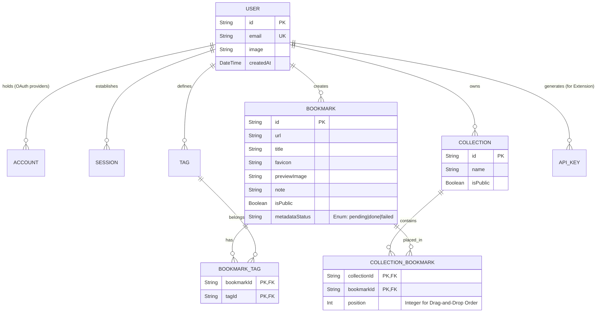
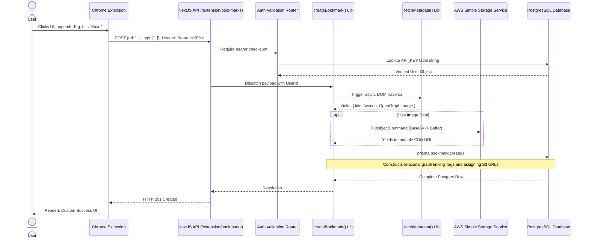

# Linkmark: The Definitive Architecture & Engineering Devlog

## 1. Executive Summary & Vision

Linkmark is engineered to be a best-in-class, full-stack bookmark management platform. At its core, it solves the problem of "link rot" and disorganized content hoarding by providing a unified interface to save, categorize, and actively monitor the health of remote URLs.

Unlike traditional browser-sync bookmark managers, Linkmark operates as an independent, cloud-native repository. It is built upon modern web infrastructure, leveraging the Next.js App Router for isomorphic frontend rendering and API provision, a PostgreSQL database managed via Prisma ORM for relational persistence, an AWS Lambda-powered background worker for scheduled system maintenance, and a custom Manifest V3 Chrome Extension to facilitate frictionless user ingestion from anywhere on the web.

This document serves as the absolute, definitive reference manual for the project’s file structure, architectural paradigms, specific implementations of business logic, cross-system data flow, security models, and deployment strategies.

---

## 2. High-Level Architecture & Topology

The Linkmark system is composed of three distinct execution environments that coordinate asynchronously.

1. **The Core Web Monolith (Next.js/Node.js):** The primary user interface and standard API gateway.
2. **The Worker Subnet (AWS Lambda):** Ephemeral, stateless execution contexts responsible for heavy I/O network tasks.
3. **The Edge Client (Chrome Extension):** A distributed client operating within the user's local browser context.

```mermaid
flowchart TD
    %% Edge Clients
    U([Browser UI Client]) -->|React Server Components & Server Actions| NextJS[Next.js Application]
    Ext([Chrome Extension V3]) -->|POST /api/extension/bookmarks & Bearer Token| NextJS
    Chron([AWS EventBridge]) -->|Cron Schedule (rate: 1 day)| Lmbd

    %% Core App
    subgraph Core Linkmark Application Environment
        NextJS
    end

    %% Persistence & Storage
    NextJS -->|Prisma Client (TCP/PgBouncer)| PG[(PostgreSQL)]
    NextJS -.->|AWS SDK v3 (S3 PutObject API)| S3[(AWS S3 Data Lake)]
    NextJS -.->|AWS SDK v3 (Invoke API)| Lmbd[AWS Lambda Worker]

    subgraph AWS Lambda Execution Context
        Lmbd -.->|node-postgres (TCP)| PG
        Lmbd -.->|Concurrent HTTP HEAD Requests| ExtWeb((External Websites / The Open Web))
        Lmbd -.->|Bulk SQL UPDATE Reports| PG
    end
```

---

## 3. Project Root & Core Configuration

The root directory dictates the build pipeline, compiler strictness, and development environment setup.

*   **`package.json`**: The dependency matrix. Notable inclusions:
    *   **Framework**: `next` (v14/15+ App Router), `react`, `react-dom`.
    *   **Persistence**: `@prisma/client`, `prisma` (CLI logic for generation and migration).
    *   **Cloud Integrations**: `@aws-sdk/client-s3`, `@aws-sdk/client-lambda` (modular v3 SDK to minimize bundle size).
    *   **Authentication**: `next-auth` (Auth.js beta), `@auth/prisma-adapter`.
    *   **Interaction Design**: `@dnd-kit/core`, `@dnd-kit/sortable`, `@dnd-kit/utilities` for complex drag-and-drop matrices.
*   **`tsconfig.json`**: Enforces strict TypeScript rules (`"strict": true`). This guarantees that null-checks and type inference bridge seamlessly between Prisma schemas and React prop interfaces.
*   **`.env.example`**: The infrastructural blueprint required for runtime. Defines:
    *   `DATABASE_URL`: Connection string (PostgreSQL).
    *   `NEXTAUTH_SECRET`, `GITHUB_ID`, `GITHUB_SECRET`: For cryptographic signing and OAuth handshakes.
    *   `AWS_REGION`, `AWS_ACCESS_KEY_ID`, `AWS_SECRET_ACCESS_KEY`, `S3_BUCKET_NAME`: AWS IAM policies requiring S3 Write and Lambda Execute permissions.
*   **`eslint.config.mjs` & `postcss.config.mjs`**: Enforces code style. PostCSS compiles Tailwind CSS v4, parsing the React tree to output a minimal CSS payload.

---

## 4. The Next.js Web Monolith (`src/`)

By utilizing the Next.js App Router paradigm, Linkmark eliminates the historical separation between "frontend" and "backend" file hierarchies. Routing is determined strictly by the file system.

### A. Routing and API Gateways (`src/app/`)

This directory is strictly organized to map to URLs.

*   **`dashboard/` Segment**: The core authenticated application.
    *   **`layout.tsx`**: Wraps the dashboard with global UI (the Sidebar navigation) and enforces session validation at the edge. If `getServerSession` returns null, users are hard-redirected to `/`.
    *   **`page.tsx`**: The "All Bookmarks" feed. It implements server-side pagination and dynamic filtering.
    *   **`collections/[id]/page.tsx`**: Dynamic route rendering specific folders.
    *   **`analytics/page.tsx`**: Queries the database for `metadataStatus` and aggregates link-rot statistics, rendering charts based on Lambda worker findings.
    *   **`edit/[id]/page.tsx`**: A granular view for manually overriding metadata if the automatic scraper fails.

*   **`api/` Segment**: JSON-based REST endpoints. Next.js `route.ts` files export specific HTTP verb handlers (`export async function GET`, `POST`, etc.).
    *   **`auth/[...nextauth]/route.ts`**: The Auth.js engine. Handles the complex OAuth callback handshakes, token generation, and provider routing automatically.
    *   **`extension/bookmarks/route.ts`**: The Extension-to-Next.js bridge. **Security Note:** This endpoint bypasses standard cookie-based CSRF protections. Instead, it expects an `Authorization: Bearer <token>` header, verified against the custom `ApiKey` table in PostgreSQL.
    *   **`bookmarks/bulk/route.ts`**: Optimized endpoint utilizing Prisma's `updateMany` transactions to alter tags or collections for hundreds of bookmarks simultaneously without taxing the database connection pool.
    *   **`collections/[id]/bookmarks/reorder/route.ts`**: The endpoint responsible for saving `@dnd-kit` state. It receives an array of ID/position pairs and executes concurrent SQL updates to persist the visual drag-and-drop order.

### B. User Interface & State Management (`src/components/`)

React components are built using functional paradigms, custom hooks, and Tailwind CSS. The UI aggressively utilizes "Optimistic Updates" to ensure the application feels instantaneous, regardless of network latency.

*   **`BookmarkCard.tsx`**: A dense, localized component. It handles:
    *   Truncation of long titles and descriptions.
    *   Rendering S3 image previews via Next.js `<Image />` for automatic WebP compression and lazy loading.
    *   Accessibility (aria-labels) and dropdown menus for contextual actions.
*   **The Drag-and-Drop Implementation (`BookmarkList.tsx` & `SortableBookmarkItem.tsx`)**:
    *   Integrates `@dnd-kit`. `BookmarkList.tsx` defines the `<DndContext>` and `<SortableContext>`, establishing the collision detection algorithms (e.g., closest center).
    *   `SortableBookmarkItem.tsx` assigns the `useSortable` hook to individual nodes, connecting DOM listeners and applying CSS `transform` matrices (`translate3d(x, y, 0)`) seamlessly as the user drags.
*   **Modals & Portals (`BulkTagModal.tsx`, `ConfirmModal.tsx`)**:
    *   Utilizes React Portals (`createPortal`) to attach modal dialogs directly to `document.body`. This prevents complex nested CSS `z-index` and `overflow: hidden` conflicts, ensuring modals always overlay the entire viewport.

### C. Core Business Logic & Orchestration (`src/lib/`)

Here, route handler logic is decoupled into testable, standalone functions.

*   **`prisma.ts`**: **Critical Architecture Decision.** In development, Next.js clears the Node cache on every file save (Fast Refresh). Without a strict `globalThis.prisma` check, this would spawn thousands of lingering Prisma instances, exceeding the PostgreSQL connection limit and causing immediate crashes.
*   **`createBookmark.ts`**: The master orchestration function. It represents the most complex pipeline in the application:
    1.  Validates URL structure.
    2.  Delegates to `fetchMetadata.ts`.
    3.  If metadata returns an image URL, streams that image to `s3.ts`.
    4.  Constructs the final Prisma payload.
    5.  Executes `prisma.bookmark.create()`.
*   **`fetchMetadata.ts`**: Actively requests the target URL. It implements an HTML parser (like `cheerio`) to traverse the DOM, prioritizing `<meta property="og:image">`, `<meta name="twitter:image">`, and `<link rel="icon">`. Implements strict timeouts to prevent hanging on slow external servers.
*   **`s3.ts`**: Initializes an `S3Client`. Uses standard `PutObjectCommand` to streams base64 data to AWS S3, standardizing file names with UUIDv4 to prevent collisions, and returns immutable CDN URLs.

---

## 5. The Persistence Layer: PostgreSQL & Prisma (`prisma/`)

Prisma provides an abstraction layer over raw SQL, offering a strongly-typed Client.

*   **`schema.prisma`**: The Rosetta Stone of the application's data structure.
*   **`migrations/`**: Automatically generated `up.sql` scripts that track structural changes chronologically.

### Deep-Dive Entity Relational Model

The schema intertwines generic OAuth requirements with highly bespoke domain logic.



**Architectural Nuance: Explicit Junction Tables**
Prisma allows for "implicit" Many-to-Many relations, automatically creating hidden junction tables. Linkmark opts for **explicit** junction tables (`CollectionBookmark`, `BookmarkTag`). This is mandatory for `CollectionBookmark` because the application requires tracking *where* in a generic list a bookmark resides (the `position` Int). An implicit table cannot hold custom metadata columns.

---

## 6. AWS Lambda Worker (`lambda/`)

The background worker is completely decoupled from the Next.js runtime, existing as a separate Node.js project.

### Why Decouple?
If a user has 5,000 bookmarks, checking their HTTP status via `fetch` inside a Next.js API route would instantly exceed the memory and execution timeouts (typically 10-60 seconds) of commercial Serverless edge platforms like Vercel.

*   **`index.mjs`**: The worker execution script.
    *   **Native PG Connection**: Prisma engine binaries are large (~40MB). To keep the Lambda "cold start" blazing fast, the worker bypasses Prisma entirely, utilizing the minimal `pg` (node-postgres) driver.
    *   **Batch Request Strategy**: Queries raw URLs, then iterates through them in chunks (e.g., `let i = 0; i < bookmarks.length; i += BATCH_SIZE`).
    *   **Error Tolerance**: Executes `fetch(url, { method: 'HEAD', signal: AbortSignal.timeout(10000) })`. The HEAD request minimizes bandwidth by only asking external servers for headers, not body content.
    *   **Reporting**: Writes failed IDs back to PostgreSQL, updating `metadataStatus` or a broken flag, which is immediately reflected on the user's Next.js dashboard.

---

## 7. The Chrome Extension Ecosystem (`extension/`)

The Extension allows ingestion of URLs without requiring the user to navigate to the Next.js dashboard.

*   **`manifest.json`**: Specifies Manifest V3 compliance. Requests narrow permissions: `storage` (for API keys) and `activeTab` (to read the current frame URL).
*   **`popup.js`**: The state-managed controller.
    1.  Reads `chrome.storage.sync` for `SERVER_URL` and `API_KEY`.
    2.  Uses `chrome.tabs.query({ active: true, currentWindow: true })` to extract the URL.
    3.  Allows users to append manual tags or notes.
    4.  Fires a `POST` request.

### The Holistic Data Flow: Extension -> Database



---

## 8. Deployment Strategy & CI/CD Considerations

Because Linkmark spans multiple topologies, deployment requires staggered orchestration.

1.  **Database Migration**: Run `npx prisma migrate deploy` locally or via CI against the production PostgreSQL instance (e.g., Supabase, RDS).
2.  **Next.js Monolith Deployment**: Deploy the `src/` directory to Vercel or an EC2/Docker container. Build step must include `prisma generate`. Environment variables must be perfectly mirrored.
3.  **Lambda Deployment**: Run `npm install` within `/lambda`, zip the folder, and upload to AWS Lambda. Bind an AWS EventBridge cron rule (e.g., `rate(24 hours)`) to trigger the function.
4.  **Extension Distribution**: Zip the `/extension` directory and upload to the Chrome Web Store Developer Dashboard.

## Conclusion

Linkmark represents a highly sophisticated architectural design. By enforcing explicit module boundaries (Next.js for UX/API, Prisma for data integrity, Lambda for heavy synchronous I/O, and the Extension for edge ingestion), the application remains scalable, performant, and highly resilient against system degradation.
