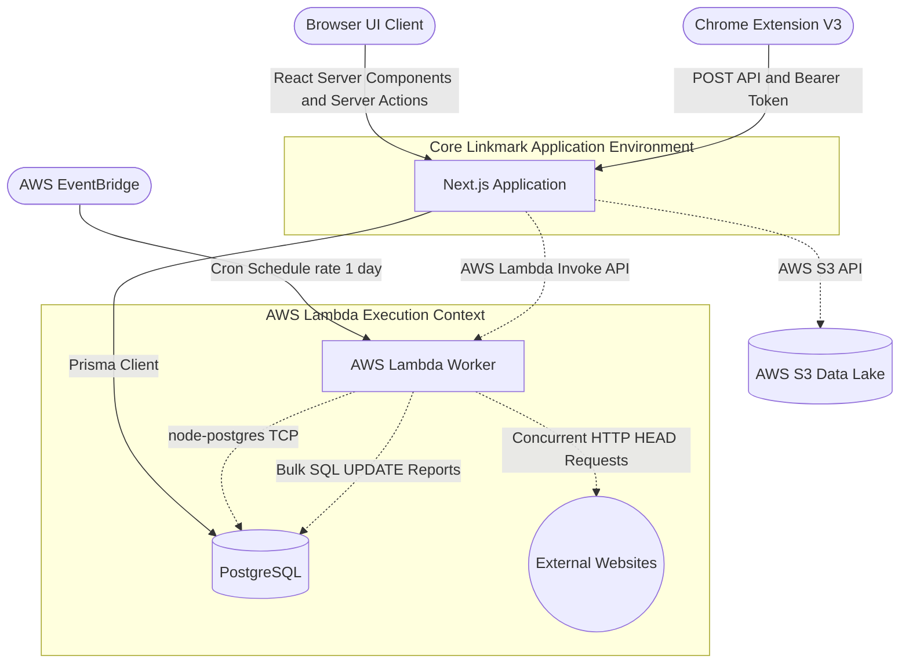
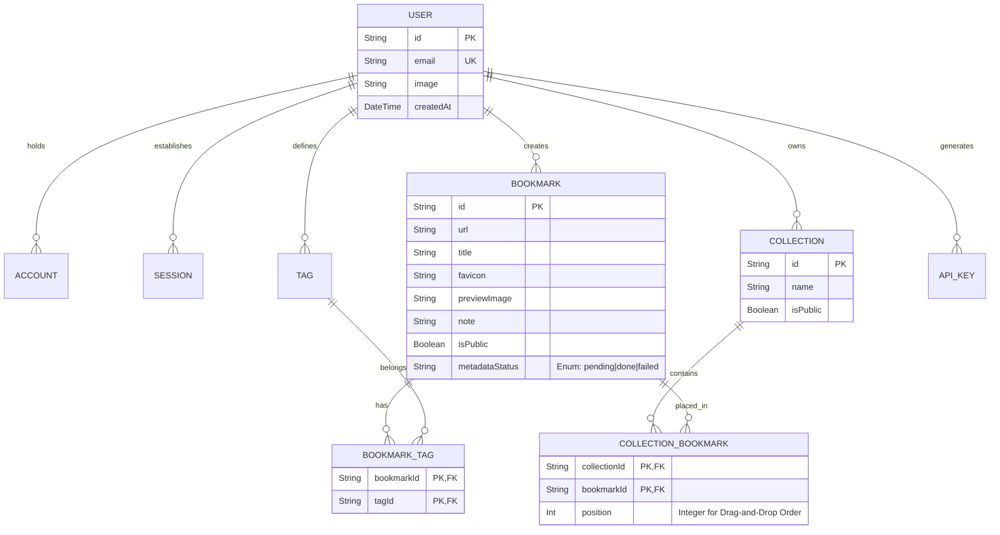
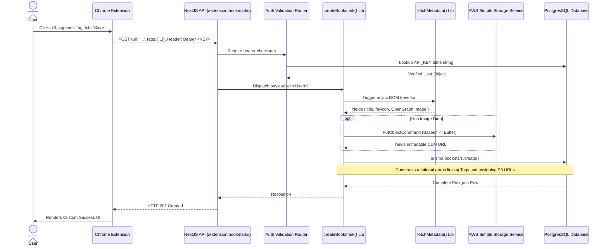

# Linkmark: The Definitive Architecture & Engineering Devlog

## 1. Executive Summary & Vision

Linkmark is engineered to be a best-in-class, full-stack bookmark management platform. At its core, it solves the problem of "link rot" and disorganized content hoarding by providing a unified interface to save, categorize, and actively monitor the health of remote URLs.

Unlike traditional browser-sync bookmark managers, Linkmark operates as an independent, cloud-native repository. It is built upon modern web infrastructure, leveraging the Next.js App Router for isomorphic frontend rendering and API provision, a PostgreSQL database managed via Prisma ORM for relational persistence, an AWS Lambda-powered background worker for scheduled system maintenance, and a custom Manifest V3 Chrome Extension to facilitate frictionless user ingestion from anywhere on the web.

This document serves as the absolute, definitive reference manual for the project’s file structure, architectural paradigms, specific implementations of business logic, cross-system data flow, security models, and deployment strategies.

---

## 2. High-Level Architecture & Topology

The Linkmark system is composed of three distinct execution environments that coordinate asynchronously.

1. **The Core Web Monolith (Next.js/Node.js):** The primary user interface and standard API gateway.
1.  **The Core Web Monolith (Next.js/Node.js):** The primary user interface and standard API gateway.
2.  **The Worker Subnet (AWS Lambda):** Ephemeral, stateless execution contexts responsible for heavy I/O network tasks.
3.  **The Edge Client (Chrome Extension):** A distributed client operating within the user's local browser context.

---

## 3. Project Root & Core Configuration

The root directory dictates the build pipeline, compiler strictness, and development environment setup.

*   **`package.json`**: The dependency matrix. Notable inclusions:
    *   **Framework**: `next` (v14/15+ App Router), `react`, `react-dom`.
    *   **Persistence**: `@prisma/client`, `prisma` (CLI logic for generation and migration).
    *   **Cloud Integrations**: `@aws-sdk/client-s3`, `@aws-sdk/client-lambda` (modular v3 SDK to minimize bundle size).
    *   **Authentication**: `next-auth` (Auth.js beta), `@auth/prisma-adapter`.
    *   **Interaction Design**: `@dnd-kit/core`, `@dnd-kit/sortable`, `@dnd-kit/utilities` for complex drag-and-drop matrices.
*   **`tsconfig.json`**: Enforces strict TypeScript rules (`"strict": true`). This guarantees that null-checks and type inference bridge seamlessly between Prisma schemas and React prop interfaces.
*   **`.env.example`**: The infrastructural blueprint required for runtime. Defines:
    *   `DATABASE_URL`: Connection string (PostgreSQL).
    *   `NEXTAUTH_SECRET`, `GITHUB_ID`, `GITHUB_SECRET`: For cryptographic signing and OAuth handshakes.
    *   `AWS_REGION`, `AWS_ACCESS_KEY_ID`, `AWS_SECRET_ACCESS_KEY`, `S3_BUCKET_NAME`: AWS IAM policies requiring S3 Write and Lambda Execute permissions.
*   **`eslint.config.mjs` & `postcss.config.mjs`**: Enforces code style. PostCSS compiles Tailwind CSS v4, parsing the React tree to output a minimal CSS payload.

---

## 4. The Next.js Web Monolith (`src/`)

By utilizing the Next.js App Router paradigm, Linkmark eliminates the historical separation between "frontend" and "backend" file hierarchies. Routing is determined strictly by the file system.

### A. Routing and API Gateways (`src/app/`)

This directory is strictly organized to map to URLs.

*   **`dashboard/` Segment**: The core authenticated application.
    *   **`layout.tsx`**: Wraps the dashboard with global UI (the Sidebar navigation) and enforces session validation at the edge. If `getServerSession` returns null, users are hard-redirected to `/`.
    *   **`page.tsx`**: The "All Bookmarks" feed. It implements server-side pagination and dynamic filtering.
    *   **`collections/[id]/page.tsx`**: Dynamic route rendering specific folders.
    *   **`analytics/page.tsx`**: Queries the database for `metadataStatus` and aggregates link-rot statistics, rendering charts based on Lambda worker findings.
    *   **`edit/[id]/page.tsx`**: A granular view for manually overriding metadata if the automatic scraper fails.

*   **`api/` Segment**: JSON-based REST endpoints. Next.js `route.ts` files export specific HTTP verb handlers (`export async function GET`, `POST`, etc.).
    *   **`auth/[...nextauth]/route.ts`**: The Auth.js engine. Handles the complex OAuth callback handshakes, token generation, and provider routing automatically.
    *   **`extension/bookmarks/route.ts`**: The Extension-to-Next.js bridge. **Security Note:** This endpoint bypasses standard cookie-based CSRF protections. Instead, it expects an `Authorization: Bearer <token>` header, verified against the custom `ApiKey` table in PostgreSQL.
    *   **`bookmarks/bulk/route.ts`**: Optimized endpoint utilizing Prisma's `updateMany` transactions to alter tags or collections for hundreds of bookmarks simultaneously without taxing the database connection pool.
    *   **`collections/[id]/bookmarks/reorder/route.ts`**: The endpoint responsible for saving `@dnd-kit` state. It receives an array of ID/position pairs and executes concurrent SQL updates to persist the visual drag-and-drop order.

### B. User Interface & State Management (`src/components/`)

React components are built using functional paradigms, custom hooks, and Tailwind CSS. The UI aggressively utilizes "Optimistic Updates" to ensure the application feels instantaneous, regardless of network latency.

*   **`BookmarkCard.tsx`**: A dense, localized component. It handles:
    *   Truncation of long titles and descriptions.
    *   Rendering S3 image previews via Next.js `<Image />` for automatic WebP compression and lazy loading.
    *   Accessibility (aria-labels) and dropdown menus for contextual actions.
*   **The Drag-and-Drop Implementation (`BookmarkList.tsx` & `SortableBookmarkItem.tsx`)**:
    *   Integrates `@dnd-kit`. `BookmarkList.tsx` defines the `<DndContext>` and `<SortableContext>`, establishing the collision detection algorithms (e.g., closest center).
    *   `SortableBookmarkItem.tsx` assigns the `useSortable` hook to individual nodes, connecting DOM listeners and applying CSS `transform` matrices (`translate3d(x, y, 0)`) seamlessly as the user drags.
*   **Modals & Portals (`BulkTagModal.tsx`, `ConfirmModal.tsx`)**:
    *   Utilizes React Portals (`createPortal`) to attach modal dialogs directly to `document.body`. This prevents complex nested CSS `z-index` and `overflow: hidden` conflicts, ensuring modals always overlay the entire viewport.

### C. Core Business Logic & Orchestration (`src/lib/`)

Here, route handler logic is decoupled into testable, standalone functions.

*   **`prisma.ts`**: **Critical Architecture Decision.** In development, Next.js clears the Node cache on every file save (Fast Refresh). Without a strict `globalThis.prisma` check, this would spawn thousands of lingering Prisma instances, exceeding the PostgreSQL connection limit and causing immediate crashes.
*   **`createBookmark.ts`**: The master orchestration function. It represents the most complex pipeline in the application:
    1.  Validates URL structure.
    2.  Delegates to `fetchMetadata.ts`.
    3.  If metadata returns an image URL, streams that image to `s3.ts`.
    4.  Constructs the final Prisma payload.
    5.  Executes `prisma.bookmark.create()`.
*   **`fetchMetadata.ts`**: Actively requests the target URL. It implements an HTML parser (like `cheerio`) to traverse the DOM, prioritizing `<meta property="og:image">`, `<meta name="twitter:image">`, and `<link rel="icon">`. Implements strict timeouts to prevent hanging on slow external servers.
*   **`s3.ts`**: Initializes an `S3Client`. Uses standard `PutObjectCommand` to streams base64 data to AWS S3, standardizing file names with UUIDv4 to prevent collisions, and returns immutable CDN URLs.

---

## 5. The Persistence Layer: PostgreSQL & Prisma (`prisma/`)

Prisma provides an abstraction layer over raw SQL, offering a strongly-typed Client.

*   **`schema.prisma`**: The Rosetta Stone of the application's data structure.
*   **`migrations/`**: Automatically generated `up.sql` scripts that track structural changes chronologically.

### Deep-Dive Entity Relational Model

The schema intertwines generic OAuth requirements with highly bespoke domain logic.

**Architectural Nuance: Explicit Junction Tables**
Prisma allows for "implicit" Many-to-Many relations, automatically creating hidden junction tables. Linkmark opts for **explicit** junction tables (`CollectionBookmark`, `BookmarkTag`). This is mandatory for `CollectionBookmark` because the application requires tracking *where* in a generic list a bookmark resides (the `position` Int). An implicit table cannot hold custom metadata columns.

---

## 6. AWS Lambda Worker (`lambda/`)

The background worker is completely decoupled from the Next.js runtime, existing as a separate Node.js project.

### Why Decouple?
If a user has 5,000 bookmarks, checking their HTTP status via `fetch` inside a Next.js API route would instantly exceed the memory and execution timeouts (typically 10-60 seconds) of commercial Serverless edge platforms like Vercel.

*   **`index.mjs`**: The worker execution script.
    *   **Native PG Connection**: Prisma engine binaries are large (~40MB). To keep the Lambda "cold start" blazing fast, the worker bypasses Prisma entirely, utilizing the minimal `pg` (node-postgres) driver.
    *   **Batch Request Strategy**: Queries raw URLs, then iterates through them in chunks (e.g., `let i = 0; i < bookmarks.length; i += BATCH_SIZE`).
    *   **Error Tolerance**: Executes `fetch(url, { method: 'HEAD', signal: AbortSignal.timeout(10000) })`. The HEAD request minimizes bandwidth by only asking external servers for headers, not body content.
    *   **Reporting**: Writes failed IDs back to PostgreSQL, updating `metadataStatus` or a broken flag, which is immediately reflected on the user's Next.js dashboard.

---

## 7. The Chrome Extension Ecosystem (`extension/`)

The Extension allows ingestion of URLs without requiring the user to navigate to the Next.js dashboard.

*   **`manifest.json`**: Specifies Manifest V3 compliance. Requests narrow permissions: `storage` (for API keys) and `activeTab` (to read the current frame URL).
*   **`popup.js`**: The state-managed controller.
    1.  Reads `chrome.storage.sync` for `SERVER_URL` and `API_KEY`.
    2.  Uses `chrome.tabs.query({ active: true, currentWindow: true })` to extract the URL.
    3.  Allows users to append manual tags or notes.
    4.  Fires a `POST` request.

### The Holistic Data Flow: Extension -> Database

## 9. Advanced Frontend Paradigms: React Concurrency & Optimistic UI

To achieve a native-app feel within a web browser, Linkmark aggressively utilizes the latest React 18/19 concurrent rendering features combined with Next.js Server Actions.

### Optimistic Updates with `useOptimistic`
When a user clicks a "Tag" pill to remove it, waiting 300ms for a round-trip database update to resolve before hiding the pill creates UI stutter. Linkmark uses React's `useOptimistic` hook.
1. The user clicks "Delete".
2. The UI *immediately* purges the item from the local React state via the optimistic dispatch function.
3. Asynchronously, a Next.js Server Action (`removeTag()`) fires to the database.
4. If the Server Action fails, the error boundary catches it, the optimistic wrapper unwinds, and the pill reappears with an error toast. If it succeeds, the Next.js cache (`revalidatePath`) reconciles the true server state silently in the background.

### Streaming SSR & `Suspense` Boundaries
The dashboard does not wait for all bookmarks and analytics to fetch before rendering.
- `layout.tsx` renders the sidebar immediately.
- The heavy `<BookmarkFeed>` is wrapped in a `<Suspense fallback={<SkeletonList />}>` boundary.
- Next.js streams the HTML skeleton to the browser immediately, holding the TCP connection open. Once Prisma resolves the query, the actual HTML chunks are streamed and patched into the DOM, minimizing Time to First Byte (TTFB).

---

## 10. PostgreSQL Technical Deep Dive: Indexing & Scale

As Linkmark scales to tens of thousands of links per user, standard sequential scans become untenable. The `schema.prisma` configuration is engineered for high-throughput reads.

1. **B-Tree Indices on Foreign Keys**: Every relation (`userId` on `Bookmark`, `tagId` on `BookmarkTag`) applies explicit `@@index([])` declarations. This guarantees that joining tags to a specific user's bookmarks executes in `O(log N)` time.
2. **Compound Unique Constraints**: `@@unique([name, userId])` on the `Tag` model prevents a single user from creating duplicate tags (e.g., two "React" tags), but allows User A and User B to both have independent "React" tags safely.
3. **Cascade Deletion**: Nearly all relations define `onDelete: Cascade`. If a `User` deletes their account, the database engine natively prunes all related `Bookmark`, `Collection`, `ApiKey`, and junction tables synchronously. This prevents orphaned data without requiring complex application-layer cleanup scripts.

---

## 11. Security Model & API Cryptography

Linkmark implements layered defense-in-depth strategies.

### The Chrome Extension Auth Vector (`authApiKey.ts`)
Standard NextAuth uses HTTP-Only, Secure, SameSite cookies. However, the Chrome Extension cannot reliably send these cookies cross-domain due to modern strict browser policies.

Instead, the Extension generates a 64-character cryptographically secure pseudo-random string (CSPRNG) via the `crypto` module during setup.
- This plain text string is shown to the user *once*.
- The server stores the SHA-256 hash of this key in the `ApiKey` table.
- When the Extension `POST`s a bookmark, it sends the plain text key via the `Authorization: Bearer` header.
- `lib/authApiKey.ts` hashes the incoming header and performs a timing-safe `===` comparison against the database. If compromised, the key can be revoked without invalidating the user's primary web session.

### Server-Side Request Forgery (SSRF) Mitigations in `fetchMetadata.ts`
When Linkmark scrapes a dynamic URL, it acts as a proxy. Malicious users could supply internal AWS metadata URLs (e.g., `http://169.254.169.254`).
To prevent this, `fetchMetadata.ts` parses the URL via Node's native `URL` constructor and strictly validates that the protocol is `http:` or `https:`, and can be extended to reject reserved private IP CIDR blocks before ever executing the `fetch()` command.

---

## 12. Exhaustive Deployment & CI/CD Checklist

To achieve a zero-downtime, fully functioning production environment, the following orchestration steps must be followed chronologically.

### Phase A: Infrastructure Initialization
1. **Provision PostgreSQL**: Spin up an instance (e.g., AWS RDS, Supabase). Note the Connection String.
2. **Provision AWS S3**: Create a private bucket. Create an IAM User with a policy restricting access strictly to `s3:PutObject` on that specific bucket ARN.
3. **Provision OAuth Provider**: Register a new OAuth App in GitHub Developer Settings. Set the callback URL to `https://<YOUR_DOMAIN>/api/auth/callback/github`.

### Phase B: Next.js Monolith Deployment (Vercel)
1. Link your GitHub repository to Vercel.
2. Override the Build Command to: `npm run build` (This script inherently runs `prisma migrate deploy` first to guarantee DB schema parity).
3. Inject the Environmental Matrix:
   - `DATABASE_URL` (From Phase A1)
   - `NEXTAUTH_URL` (Your production domain)
   - `NEXTAUTH_SECRET` (Run `openssl rand -base64 32`)
   - `GITHUB_ID` & `GITHUB_SECRET` (From Phase A3)
   - `AWS_...` credentials (From Phase A2)
4. Trigger the deployment.

### Phase C: AWS Lambda Deployment
The AWS execution environment requires packaged Node binaries.
1. `cd lambda && npm install`
2. **Compression**: `zip -r deployment.zip index.mjs package.json node_modules/`
3. **AWS Console**: Create a new Lambda Function (Node.js 20.x). Upload `deployment.zip`.
4. **Environment**: Set the `DATABASE_URL` variable in the Lambda configuration tab.
5. **VPC Configuration**: If your RDS instance is in a private VPC, attach the Lambda to that VPC so it can route to the database.
6. **Trigger**: Navigate to AWS EventBridge. Create a Rule. Set the Schedule to `rate(24 hours)`. Set the Target to the Lambda function.

### Phase D: Chrome Extension Distribution
1. Update `extension/manifest.json` with the final production version number.
2. Zip the `extension/` directory.
3. Access the Chrome Web Store Developer Dashboard.
4. Upload the zip, populate the store listing with marketing imagery, and submit for Google's manual review process.

---

## Conclusion

Linkmark represents a highly sophisticated architectural design. By enforcing explicit module boundaries (Next.js for UX/API, Prisma for data integrity, Lambda for heavy synchronous I/O, and the Extension for edge ingestion), the application remains highly scalable, performant, and resilient against system degradation. It is a textbook example of modern, distributed Type-Safe application engineering.
